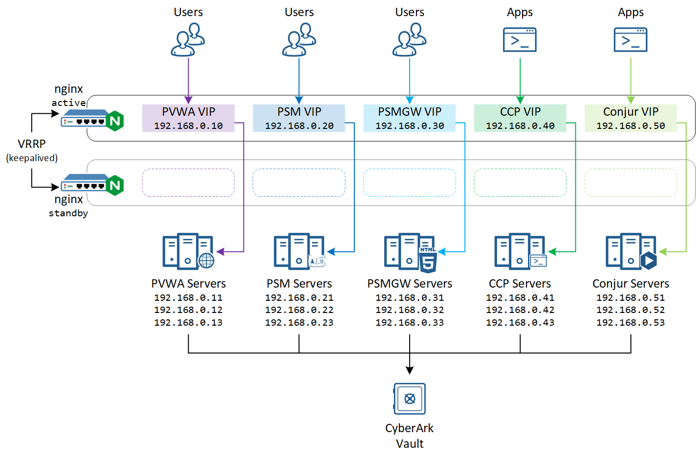

# Load Balancing CyberArk Servers

There are several services in CyberArk products that requires load balancing:

| CyberArk Server | Description |
| --- | --- |
| Password Vault Web Access (PVWA)  | Web console for CyberArk PAM |
| Privilege Session Manager (PSM)  | Jump host and session recording for CyberArk PAM |
| PSM Gateway (PSMGW)  | Placed in front of PSM to deliver sessions in browser windows, a.k.a. HTML5 Gateway  |
| Central Credential Provider (CCP) | CyberArk Secrets Manager for static, monolithic, traditional, and COTS applications |
| Conjur | CyberArk Secrets Manager for DevOps and CI/CD applications |



- For development environments or small-to-mid enterprise environments, deploying state-of-the-art Application Delivery Controllers (ADCs) may not be an optimized solution.
- This guide provides an overview on how open source software can help to load balance CyberArk Servers

# 1. Keepalived Setup

- Keepalived provides high availability capabilities to automatically failover the virtual services in event of a node failure
  - Keepalived uses virtual router redundancy protocol (VRRP) to assign the virtual IP to the master node
  - Keepalived can optionally create Linux Virtual Server (LVS) to perform load balancing, but NGINX or HAProxy is usually chosen for their expansive load balancing options, e.g. HTTP SSL termination
  - The NGINX service listens on the virtual IPs managed by keepalived
- Ref:
  - <https://access.redhat.com/documentation/en-us/red_hat_enterprise_linux/7/html/load_balancer_administration/ch-keepalived-overview-vsa>
  - <https://docs.nginx.com/nginx/admin-guide/high-availability/ha-keepalived/>

## 1.1. Install keepalived on both nodes
```console
yum -y install keepalived
```
- Edit the keepalived config file `/etc/keepalived/keepalived.conf` **on both nodes**
  - The respective reference config files for master and backup nodes are in the next [Keepalived Configuration Files Section](#12-keepalived-configuration-files)
```console
mv /etc/keepalived/keepalived.conf /etc/keepalived/keepalived.conf.bak
vi /etc/keepalived/keepalived.conf
```

## 1.2. Keepalived Configuration Files

### 1.2.1. Master Node Configuration
```console
global_defs{
    script_user root
    enable_script_security
}
vrrp_script check_vip_health {
    script "/usr/libexec/keepalived/nginx-ha-check.sh"
    interval 10
    weight   50
}
vrrp_instance VI_1 {
    state MASTER
    interface eth0
    virtual_router_id 10
    priority 100
    advert_int 1
    unicast_src_ip 192.168.0.91/24
    unicast_peer {
        192.168.0.92/24
    }
    virtual_ipaddress {
        192.168.0.10/24
        192.168.0.20/24
        192.168.0.30/24
        192.168.0.40/24
        192.168.0.50/24
    }
    authentication {
        auth_type PASS
        auth_pass cyberark
    }
    track_script {
        check_vip_health
    }
    notify "/usr/libexec/keepalived/nginx-ha-notify.sh"
}
```

### 1.2.2. Backup Node Configuration
```console
global_defs{
    script_user root
    enable_script_security
}
vrrp_script check_vip_health {
    script "/usr/libexec/keepalived/nginx-ha-check.sh"
    interval 10
    weight   50
}
vrrp_instance VI_1 {
    state BACKUP
    interface eth0
    virtual_router_id 10
    priority 90
    advert_int 1
    unicast_src_ip 192.168.0.92/24
    unicast_peer {
        192.168.0.91/24
    }
    virtual_ipaddress {
        192.168.0.10/24
        192.168.0.20/24
        192.168.0.30/24
        192.168.0.40/24
        192.168.0.50/24
    }
    authentication {
        auth_type PASS
        auth_pass cyberark
    }
    track_script {
        check_vip_health
    }
    notify "/usr/libexec/keepalived/nginx-ha-notify.sh"
}
```

## 1.3. Prepare the Notification and Tracking Scripts

☝️ **Note**: keepalived scripts should be placed in `/usr/libexec/keepalived/` where the correct SELinux file context `keepalived_unconfined_script_t` is assigned
- Trying to get keepalive to run scripts from elsewhere may result in `permission denied` errors
- Google for `keepalive setenforce 0` and you find that many guides disable SELinux - this script-doesn't-run behaviour is one of the reasons for disabling SELinux

### 1.3.1. Tracking Script
- Prepare the HA check script **on both nodes**
```console
vi /usr/libexec/keepalived/nginx-ha-check.sh
```
- The HA check script will `curl` to the PVWA virtual IP - thsi script returns `0` if curl is successful
```console
#!/bin/bash
curl -Lk https://192.168.0.10 -o /dev/null -s
exit $?
```
- Add executable permission to script
```console
chmod +x /usr/libexec/keepalived/nginx-ha-check.sh
```

### 1.3.2. Notification Script
- Prepare the HA notify script **on both nodes**
```console
vi /usr/libexec/keepalived/nginx-ha-notify.sh
```
- The HA notify script will start the nginx service when the node state changes to master, and stop the nginx service when the node state changes to backup or fault
```console
#!/bin/bash
TYPE=$1
NAME=$2
STATE=$3
case $STATE in
  "MASTER")
    systemctl start nginx
    logger -t nginx-ha-keepalived "VRRP $TYPE $NAME changed to $STATE state"
    exit 0
    ;;
  "BACKUP"|"FAULT")
    systemctl stop nginx
    logger -t nginx-ha-keepalived "VRRP $TYPE $NAME changed to $STATE state"
    exit 0
    ;;
  *)
    logger -t nginx-ha-keepalived "Unknown state $STATE for VRRP $TYPE $NAME"
    exit 1
    ;;
esac
```
- Add executable permission to script
```console
chmod +x /usr/libexec/keepalived/nginx-ha-notify.sh
```

## 1.4. Start Keepalived
- Allow VRRP communication through firewall and start keepalived service **on both nodes**
```console
firewall-cmd --add-rich-rule='rule protocol value="vrrp" accept' --permanent
firewall-cmd --reload
systemctl enable --now keepalived
```

# 2. NGINX Setup

- NGINX provides reverse proxy and load balancing capabilities to broker connection to, and handle failures for backend CyberArk servers
  - A server block is configured for each virtual service, listening on the virtual IP managed by keepalived
  - NGINX `http` module: for HTTP-based services (PVWA, PSMGW, CCP and Conjur), enables SSL termination
  - NGINX `stream` module: for TCP/UDP-based services (PVWA, PSM, PSMGW, CCP and Conjur), straightforward SSL passthrough
- Ref:
  - <https://docs.nginx.com/nginx/admin-guide/load-balancer/http-load-balancer/>
  - <https://docs.nginx.com/nginx/admin-guide/security-controls/terminating-ssl-tcp/>
  - <https://docs.nginx.com/nginx/admin-guide/load-balancer/tcp-udp-load-balancer/>

- Install NGINX, enable NGINX to listen on ports in SELinux, add firewall rules
```console
yum -y install nginx
setsebool -P httpd_can_network_connect on
firewall-cmd --permanent --add-service https && firewall-cmd --reload
```
- Edit the NGINX listener and load balancing config file `/etc/nginx/nginx.conf`
  - The respective reference config files for PVWA, PSM, PSMGW, CCP and Conjur are in below [NGINX Configuration Files Section](#22-nginx-configuration-files)
```console
mv /etc/nginx/nginx.conf /etc/nginx/nginx.conf.bak
vi /etc/nginx/nginx.conf
nginx -t
```
- ☝️ **Note**: Do not start or enable the nginx service, the nginix service start/stop are controlled by `nginx-ha-notify` script in keepalived

## 2.1. Generating SSL certificates

### 2.1.1. Generate a self-signed certificate authority

#### Method 1 - Generate key first, then CSR, then certificate
- Generate private key of the self-signed certificate authority
```console
[root@ccyberark ~]# openssl genrsa -out cacert.key 2048
Generating RSA private key, 2048 bit long modulus (2 primes)
...........................................................................+++++
.......................................+++++
e is 65537 (0x010001)
```
- Generate certificate of the self-signed certificate authority
- **Note**: change the common name of the certificate according to your environment
```console
[root@conjur ~]# openssl req -x509 -new -nodes -key cacert.key -days 365 -sha256 -out cacert.pem
You are about to be asked to enter information that will be incorporated
into your certificate request.
What you are about to enter is what is called a Distinguished Name or a DN.
There are quite a few fields but you can leave some blank
For some fields there will be a default value,
If you enter '.', the field will be left blank.
-----
Country Name (2 letter code) [XX]:.
State or Province Name (full name) []:
Locality Name (eg, city) [Default City]:.
Organization Name (eg, company) [Default Company Ltd]:.
Organizational Unit Name (eg, section) []:
Common Name (eg, your name or your server's hostname) []:vx Lab Certificate Authority
Email Address []:
```
#### Method 2 - Generate key and certificate in a single command
```console
[root@ccyberark ~]# openssl req -newkey rsa:2048 -days "365" -nodes -x509 -keyout cacert.key -out cacert.pem
Generating a RSA private key
...............................................+++++
.........+++++
writing new private key to 'cacert.key'
-----
You are about to be asked to enter information that will be incorporated
into your certificate request.
What you are about to enter is what is called a Distinguished Name or a DN.
There are quite a few fields but you can leave some blank
For some fields there will be a default value,
If you enter '.', the field will be left blank.
-----
Country Name (2 letter code) [XX]:.
State or Province Name (full name) []:
Locality Name (eg, city) [Default City]:.
Organization Name (eg, company) [Default Company Ltd]:.
Organizational Unit Name (eg, section) []:
Common Name (eg, your name or your server's hostname) []:vx Lab Certificate Authority
Email Address []:
```

### 2.1.2. Generate PVWA certificates
```console
openssl genrsa -out pvwa.key 2048
openssl req -new -key pvwa.key -subj "/CN=CyberArk Password Vault Web Access" -out pvwa.csr
echo "subjectAltName=DNS:pvwa.vx,DNS:pvwa1.vx,DNS:pvwa2.vx,DNS:pvwa3.vx" > pvwa-openssl.cnf
openssl x509 -req -in pvwa.csr -CA cacert.pem -CAkey cacert.key -CAcreateserial -days 365 -sha256 -out pvwa.pem -extfile pvwa-openssl.cnf
```

### 2.1.3. Generate PSMGW certificates
```console
openssl genrsa -out psmgw.key 2048
openssl req -new -key psmgw.key -subj "/CN=CyberArk HTML5 Gateway" -out psmgw.csr
echo "subjectAltName=DNS:psmgw.vx,DNS:psmgw1.vx,DNS:psmgw2.vx,DNS:psmgw3.vx" > psmgw-openssl.cnf
openssl x509 -req -in psmgw.csr -CA cacert.pem -CAkey cacert.key -CAcreateserial -days 365 -sha256 -out psmgw.pem -extfile psmgw-openssl.cnf
```

### 2.1.4. Generate CCP certificates
```console
openssl genrsa -out ccp.key 2048
openssl req -new -key ccp.key -subj "/CN=CyberArk Central Credential Provider" -out ccp.csr
echo "subjectAltName=DNS:ccp.vx,DNS:ccp1.vx,DNS:ccp2.vx,DNS:ccp3.vx" > ccp-openssl.cnf
openssl x509 -req -in ccp.csr -CA cacert.pem -CAkey cacert.key -CAcreateserial -days 365 -sha256 -out ccp.pem -extfile ccp-openssl.cnf
```

### 2.1.5. Generate Conjur certificates

```console
openssl genrsa -out conjur.key 2048
openssl req -new -key conjur.key -subj "/CN=CyberArk Conjur" -out conjur.csr
echo "subjectAltName=DNS:conjur.vx,DNS:conjur-master.vx,DNS:conjur-standby1.vx,DNS:conjur-standby2.vx," > conjur-openssl.cnf
openssl x509 -req -in conjur.csr -CA cacert.pem -CAkey cacert.key -CAcreateserial -days 365 -sha256 -out conjur.pem -extfile conjur-openssl.cnf
```

## 2.2. NGINX Configuration Files

### 2.2.1. PVWA

#### Configurations on PVWA servers to capture client IP address
- Configure `HTTP_X_Forwarded_For` on PVWA servers - edit `C:\inetpub\wwwroot\PasswordVault\web.config`
```console
  <appSettings>
    ••• other configurations •••
    <add key="LoadBalancerClientAddressHeader" value="HTTP_X_Forwarded_For" />
  </appSettings>
```

#### SSL Termination
☝️ **Note**: Certificate authentication does not work with SSL Terminated load balancing, use SSL Passthrough if certificate authentication is required
```console
events {}
http {
  upstream pvwa {
    server 192.168.0.11:443;
    server 192.168.0.12:443;
    server 192.168.0.13:443;
  }
  server {
    listen 192.168.0.10:443 ssl;
    server_name pvwa.vx

    ssl on;
    ssl_certificate         /etc/nginx/ssl/pvwa.pem;
    ssl_certificate_key     /etc/nginx/ssl/pvwa.key;
    ssl_trusted_certificate /etc/nginx/ssl/cacert.pem;

    ssl_session_cache shared:SSL:20m;
    ssl_session_timeout 10m;

    ssl_prefer_server_ciphers on;
    ssl_protocols             TLSv1.2 TLSv1.3;
    ssl_ciphers               HIGH:!aNULL:!MD5;

    add_header Strict-Transport-Security "max-age=31536000";

    location / {
      proxy_pass https://pvwa;
      proxy_set_header Host              $host;
      proxy_set_header X-Real-IP         $remote_addr;
      proxy_set_header X-Forwarded-For   $proxy_add_x_forwarded_for;
      proxy_set_header X-Forwarded-Proto $scheme;
    }
  }
}
```

#### SSL Passthrough
```console
load_module /usr/lib64/nginx/modules/ngx_stream_module.so;
events {}
stream {
  upstream pvwa {
    server 192.168.0.11:443;
    server 192.168.0.12:443;
    server 192.168.0.13:443;
  }
  server {
    listen 192.168.0.10:443;
    proxy_pass pvwa;
  }
}
```

### 2.2.2. PSM

#### SSL Termination
- Not Supported

#### SSL Passthrough
```console
load_module /usr/lib64/nginx/modules/ngx_stream_module.so;
events {}
stream {
  upstream psm {
    server 192.168.0.21:3389;
    server 192.168.0.22:3389;
    server 192.168.0.23:3389;
  }
  server {
    listen 192.168.0.20:3389;
    proxy_pass psm;
  }
}
```

### 2.2.3. PSMGW

#### SSL Termination
- Ref: <https://guacamole.apache.org/doc/1.4.0/gug/reverse-proxy.html>
```console
events {}
http {
  upstream psmgw {
    server 192.168.0.31:443;
    server 192.168.0.32:443;
    server 192.168.0.33:443;
  }
  server {
    listen 192.168.0.30:443 ssl;
    server_name psmgw.vx

    ssl on;
    ssl_certificate         /etc/nginx/ssl/psmgw.pem;
    ssl_certificate_key     /etc/nginx/ssl/psmgw.key;
    ssl_trusted_certificate /etc/nginx/ssl/cacert.pem;

    ssl_session_cache shared:SSL:20m;
    ssl_session_timeout 10m;

    ssl_prefer_server_ciphers on;
    ssl_protocols             TLSv1.2 TLSv1.3;
    ssl_ciphers               HIGH:!aNULL:!MD5;

    add_header Strict-Transport-Security "max-age=31536000";

    location / {
      proxy_pass https://psmgw;
      proxy_set_header Host              $host;
      proxy_set_header X-Real-IP         $remote_addr;
      proxy_set_header X-Forwarded-For   $proxy_add_x_forwarded_for;
      proxy_set_header X-Forwarded-Proto $scheme;
      proxy_buffering off;
      proxy_http_version 1.1;
      proxy_set_header Upgrade $http_upgrade;
      proxy_set_header Connection $http_connection;
    }
  }
}
```

#### SSL Passthrough
```console
load_module /usr/lib64/nginx/modules/ngx_stream_module.so;
events {}
stream {
  upstream psmgw {
    server 192.168.0.31:443;
    server 192.168.0.32:443;
    server 192.168.0.33:443;
  }
  server {
    listen 192.168.0.30:443;
    proxy_pass psmgw;
  }
}
```

### 2.2.4. CCP

#### Configurations on CCP servers to capture client IP address
- Configure `HTTP_X_Forwarded_For` on CCP servers - edit `C:\inetpub\wwwroot\AIMWebService\web.config`
```console
  <appSettings>
    ••• other configurations •••
    <add key="TrustedProxies" value="192.168.0.40"/>
    <add key="LoadBalancerClientAddressHeader" value="HTTP_X_Forwarded_For" />
  </appSettings>
```

#### SSL Termination
☝️ **Note**: Certificate authentication does not work with SSL Terminated load balancing, use SSL Passthrough if certificate authentication is required
```console
events {}
http {
  upstream ccp {
    server 192.168.0.41:443;
    server 192.168.0.42:443;
    server 192.168.0.43:443;
  }
  server {
    listen 192.168.0.40:443 ssl;
    server_name ccp.vx

    ssl on;
    ssl_certificate         /etc/nginx/ssl/ccp.pem;
    ssl_certificate_key     /etc/nginx/ssl/ccp.key;
    ssl_trusted_certificate /etc/nginx/ssl/cacert.pem;

    ssl_session_cache shared:SSL:20m;
    ssl_session_timeout 10m;

    ssl_prefer_server_ciphers on;
    ssl_protocols             TLSv1.2 TLSv1.3;
    ssl_ciphers               HIGH:!aNULL:!MD5;

    add_header Strict-Transport-Security "max-age=31536000";

    location / {
      proxy_pass https://ccp;
      proxy_set_header Host              $host;
      proxy_set_header X-Real-IP         $remote_addr;
      proxy_set_header X-Forwarded-For   $proxy_add_x_forwarded_for;
      proxy_set_header X-Forwarded-Proto $scheme;
    }
  }
}
```

#### SSL Passthrough
```console
load_module /usr/lib64/nginx/modules/ngx_stream_module.so;
events {}
stream {
  upstream ccp {
    server 192.168.0.41:443;
    server 192.168.0.42:443;
    server 192.168.0.43:443;
  }
  server {
    listen 192.168.0.40:443;
    proxy_pass ccp;
  }
}
```

### 2.2.5. Conjur

#### Configurations on Conjur servers to capture client IP address
```console
podman exec conjur evoke proxy add 192.168.0.50
```

#### SSL Termination
```console
events {}
http {
  upstream conjur {
    server 192.168.0.51:443;
    server 192.168.0.52:443;
    server 192.168.0.53:443;
  }
  server {
    listen 192.168.0.50:443 ssl;
    server_name conjur.vx

    ssl on;
    ssl_certificate         /etc/nginx/ssl/conjur.pem;
    ssl_certificate_key     /etc/nginx/ssl/conjur.key;
    ssl_trusted_certificate /etc/nginx/ssl/cacert.pem;

    ssl_session_cache shared:SSL:20m;
    ssl_session_timeout 10m;

    ssl_prefer_server_ciphers on;
    ssl_protocols             TLSv1.2 TLSv1.3;
    ssl_ciphers               HIGH:!aNULL:!MD5;

    add_header Strict-Transport-Security "max-age=31536000";

    location / {
      proxy_pass https://conjur;
      proxy_set_header Host              $host;
      proxy_set_header X-Real-IP         $remote_addr;
      proxy_set_header X-Forwarded-For   $proxy_add_x_forwarded_for;
      proxy_set_header X-Forwarded-Proto $scheme;
    }
  }
}
```

#### SSL Passthrough
```console
load_module /usr/lib64/nginx/modules/ngx_stream_module.so;
events {}
stream {
  upstream conjur {
    server 192.168.0.51:443;
    server 192.168.0.52:443;
    server 192.168.0.53:443;
  }
  server {
    listen 192.168.0.50:443;
    proxy_pass conjur;
  }
}
```
